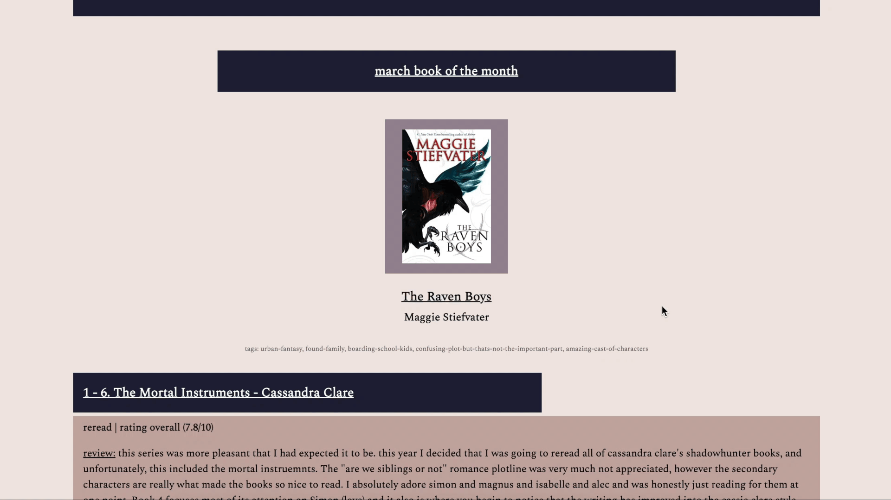

# BookBlog
[2022] book blog created with HTML/CSS

## About the Project

## Getting Started

1. download files onto your computer
2. run the index.html class
3. Have fun reading!

# Usage
## How to Navigate?

### Months Navigation Bar

- in order to select a certain month, hover over that month title and click on it

### Book Reviews

- book reviews are neatly arranged beneath the book of the month banner
- each book review title is clickable and will take you to the goodreads page for more reviews and ratings

### Book of the Month Links

- by clicking on the image of the book of the month, it will redirect you to the goodreads page (which is full of reviews, ratings, and more information)
- link will open on a separate tab

### Book Reviews Links

- by clicking on a book's title, the hyperlink will redirect you to the proper goodreads page (which is full of reviews, rating, and more information)
- link will open on a separate tab

### Minimized Window View

- view of the home screen when the window is minimized
- website is responsive and will react according to window size

### Built Using
- Atom
- HTML/CSS

### Contact
Any comments, questions, or concerns?
Contact Jacqueline Molina: molina.jq19@gmail.com

